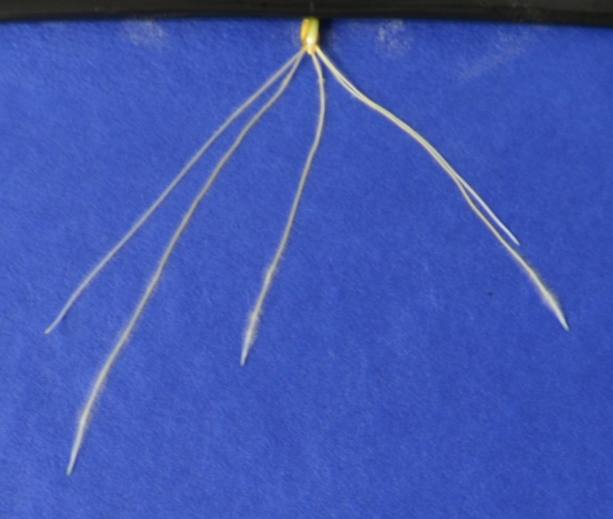
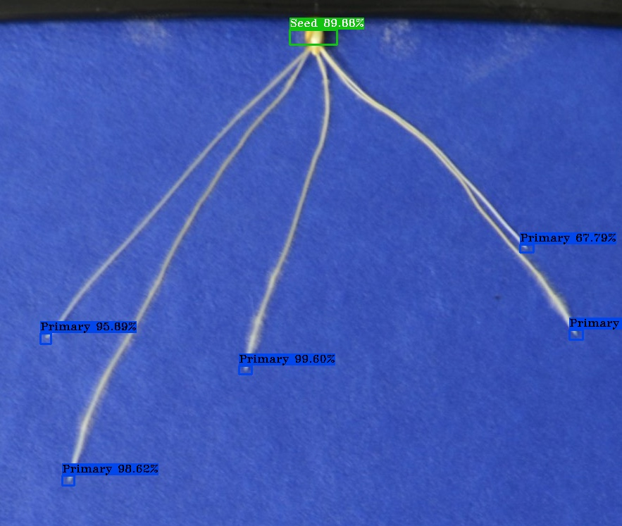
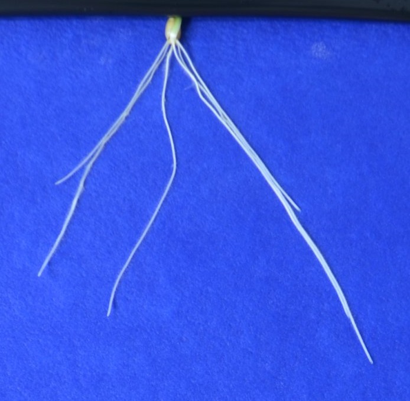
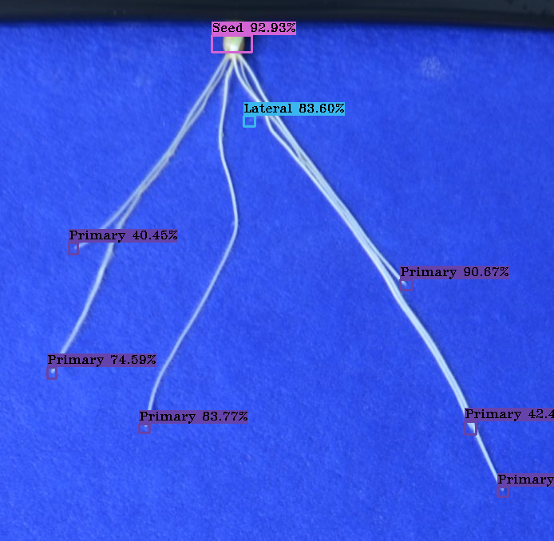

# YOLOv3 With OpenCvSharp4

This is a fork of a demo of implement pjreddie's [YOLO3](https://pjreddie.com/darknet/yolo/) with shimat's [OpenCvSharp4](https://github.com/shimat/opencvsharp) using C#.

more detail please check the original repository

The Yolov3 model used in this branch is trained on 2965 images for 7000 iterations of plant roots and can detect 3 classes. Primary, Lateral and Seed.

Image 2 

Results for Image 2

Image 3

Results for Image 3

